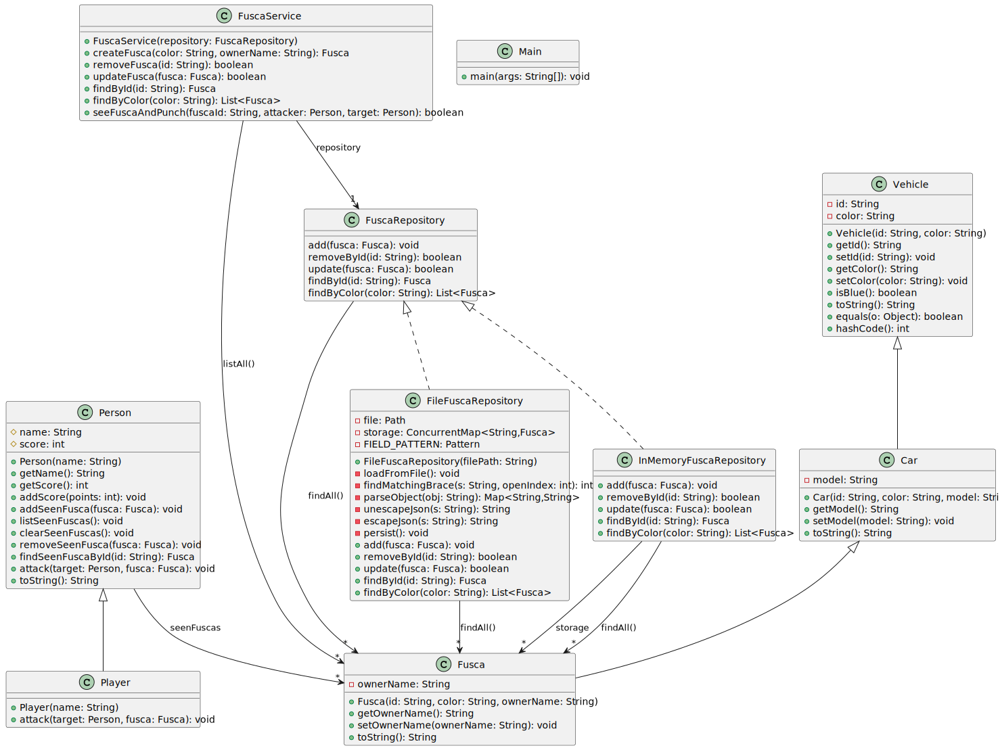

# fusca-azul-java-v2

Diagrama de classes:

[Baixar/abrir o arquivo SVG](classDiagram.svg)

1. O software terá usuários, os usuários terão nome e senha
2. O software terá um cadastro de fuscas, etc
